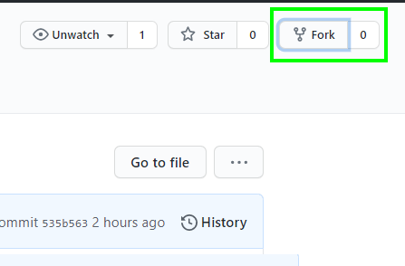
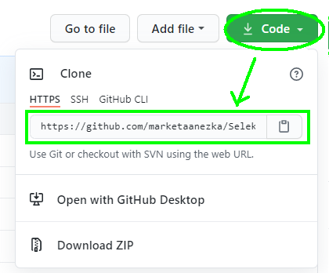
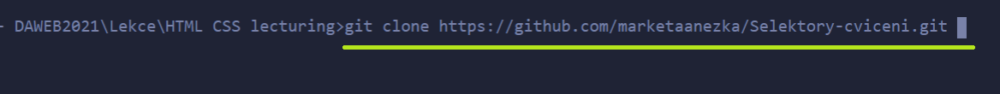
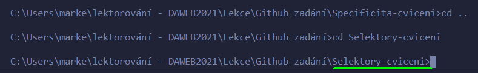

# Cvičení na CSS specificitu

## Fork úkolu

1. Přihlas se do Githubu.
2. Udělej si **fork** tohoto repozitáře (vpravo nahoře). Tím se ti úkol zkopíruje to tvého Github účtu.  
    
3. Tento repozitář si ze svého Githubu potom naklonuj k sobě na disk.
    

Zkopíruj si odkaz ze záložky **clone** a potom v terminálu ve vybrané složce spusť příkaz `git clone ODKAZ`.   
Například `git clone https://github.com/marketaanezka/Specificita-cviceni.git`.   
Místo `marketaanezka` budeš mít svoje Github uživatelské jméno.   
     

4. Tady už můžeš přidávat, commitovat a pushovat změny a uvidíš je na svém Githubu.   
! Pokud by sis naklonovala rovnou tento repozitář, nemohla bys do něj ukládat změny!    
Na to, jak udělat fork repozitáře se můžes podívat v [krátkém videu](https://youtu.be/K7rE3jRCjD4).    

## Zadání   
Prohlédni si soubor index.html. Všimni si, že na řádku 9 je do stránky naimportovaná knihovna Bootstrap.    
Ta zajišťuje, že použitím určitých tříd se nám dané elementy rovnou nastylují.    
    

### Přepiš stylování elementů podle zadání
     

#### Styly piš do souboru style.css
1. Tělu kartičky (vše pod obrázkem) nastav pozadí na barvu `#fff0ee` a nastav mu padding nahoře a dole na 1rem a po stranách na 1.5rem
2. Nadpis udělej kapitálkami (vlasnost `text-transform`) a přepiš margin-bottom na 1rem.
3. Tlačítku změn barvu pozadí a rámečku na barvu `#b10849`

Spusť si stránku a podívej se do developer tools *(pravým + prozkoumat stránku* nebo *F12)* na stylování jednotlivých elementů a jejich specificitu.
Ve svém stylování budeš muset tuto specificitu přebít. Nepoužívej ale inline stylování, ani `!important`.    
Ve složce **vysledek** máš soubor **specificita_result** a **specificita_hint**, které ti poradí, které stylování musíš přepsat.

### Ulož si změny do Githubu

V terminálu se přesuň do správné složky. Pro přesunutí do složky použij `cd NAZEVSLOZKY`, pro přesun o složku výš použij `cd ..`    
    

Ve složce postupně spusť tyto příkazy:    
1. `git add .`
2. `git commit -m "Moje zprava"`
3. `git push`
